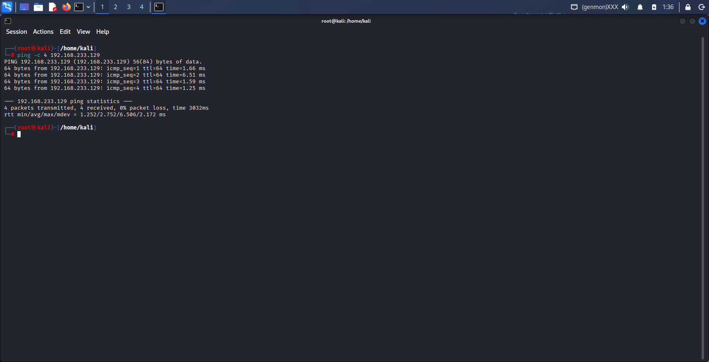
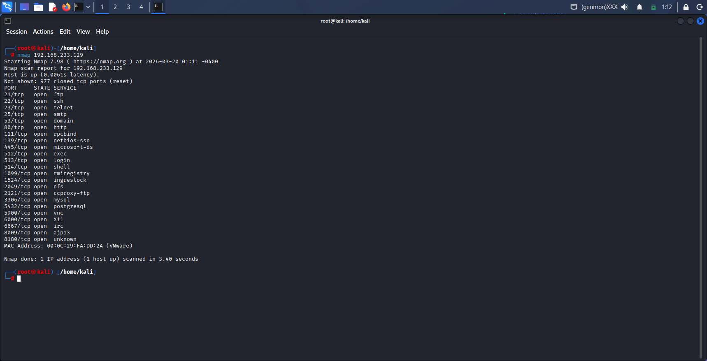
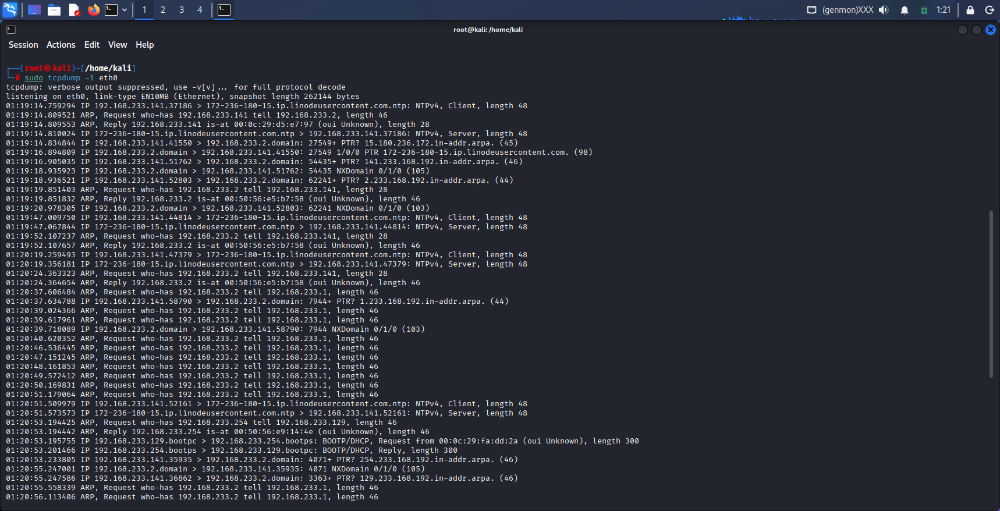
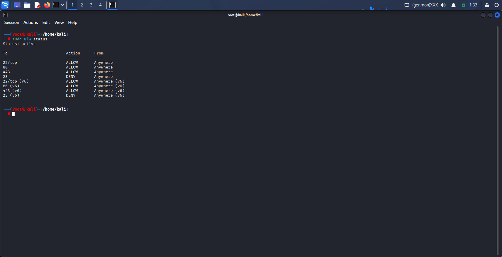

🔐 Enterprise Network Security Assessment Lab

📌 Project Overview

This project demonstrates a simulated enterprise-level network security assessment using Kali Linux.

The objective was to identify open ports, analyze live network traffic, and implement firewall rules to secure the system from potential threats.

---

🛠️ Tools & Technologies

- Nmap – Network scanning and service enumeration
- Tcpdump – Packet capture and traffic analysis
- UFW (Uncomplicated Firewall) – Firewall configuration
- Kali Linux – Testing environment

---

⚙️ Methodology

1️⃣ Network Connectivity Testing

Basic connectivity between attacker and target machine was verified using ICMP ping.

---

2️⃣ Port Scanning (Nmap)

A detailed scan was performed to identify open ports and running services on the target system.

---

3️⃣ Traffic Analysis (Tcpdump)

Live network traffic was captured and analyzed. Protocols observed include:

- ARP (Address Resolution Protocol)
- DNS (Domain Name System)
- NTP (Network Time Protocol)

---

4️⃣ Firewall Implementation (UFW)

Firewall rules were configured to allow secure services and block insecure ones:

- ✅ Allowed Ports: 22 (SSH), 80 (HTTP), 443 (HTTPS)
- ❌ Blocked Port: 23 (Telnet – insecure protocol)

---

🔍 Findings & Analysis

- Multiple open ports increase the attack surface.
- Telnet transmits data in plain text, making it vulnerable to interception.
- Continuous network traffic indicates active communication with external servers.

---

⚠️ Risks Identified

- Exposure of unnecessary services can lead to unauthorized access.
- Lack of firewall rules may allow malicious traffic.
- Unencrypted protocols (like Telnet) pose a high security risk.

---

🛡️ Security Recommendations

- Disable or restrict unused ports and services.
- Block insecure protocols such as Telnet.
- Implement firewall rules to control incoming and outgoing traffic.
- Regularly monitor network traffic for suspicious activity.

---

🖼️ Screenshots

### 🔹 Network Connectivity (Ping)

### 🔹 Nmap Scan Results

### 🔹 Traffic Analysis (Tcpdump)

### 🔹 Firewall Configuration

---

📄 Conclusion

This project highlights the practical implementation of core network security concepts, including scanning, monitoring, and firewall configuration.

It demonstrates the ability to identify risks and apply security controls in a simulated real-world environment.

---

🚀 Key Skills Gained

- Network Scanning & Enumeration
- Packet Analysis
- Firewall Configuration
- Basic Network Security Implementation
- Risk Identification & Mitigation

